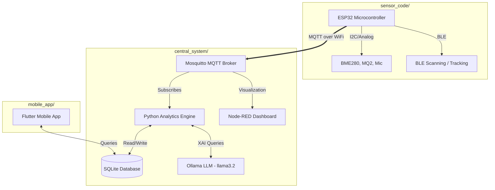

<div align="center">
  <h1>🏢 XAI-Driven Decentralized Infrastructure Monitoring and Safety Navigation System</h1>
  
  [](https://www.python.org/)
  [](https://flutter.dev/)
  [](https://isocpp.org/)
</div>

<br>

This project uses sensor data (temperature, humidity, pressure, gas, sound, and fire state) ingested via **MQTT** to evaluate safety scores and detect anomalies in real-time. **Explainable AI (XAI)** using the local **Ollama** (`llama3.2`) model provides human-readable explanations for scores and emergency alerts

---

## 🎥 Project Demonstration
[**Watch the Project Test Video here!**](https://youtu.be/p7LBNeEeAhU)


---

## 🏗️ Architecture

The project is decoupled into three primary modules:



1. **`sensor_code/` (IoT Edge Nodes)**
   Contains the C++ code (`main.cpp`) for hardware nodes (e.g., ESP32). Nodes gather physical readings and publish them over MQTT. They also scan for BLE wearables to track resident locations in real-time.
   
2. **`central_system/` (Analytics & AI Backend)**
   The Python backend. It subscribes to MQTT topics, processes incoming data in real-time, logs anomalies, calculates hourly apartment scores, and integrates with the Ollama LLM for explainable insights. It also houses real-time tracking simulations and logic.

3. **`mobile_app/` (Frontend)**
   The user-facing application built with Flutter (`appV3`). Residents or administrators use this app to view real-time safety scores, pathfinding data, and XAI explanations.

---

## 📂 Project Structure

```text
xAI/
├── assets/                 # Test videos, sensor images, and multimedia
├── central_system/         # Python backend, XAI engine, and realtime tracking
├── data/                   # SQLite database files
├── docs/                   # Project reports, documentation, and requirements
├── logs/                   # System and component logs
├── mobile_app/             # Flutter application source code
├── sensor_code/            # IoT C++ code
├── start_system.sh         # Main startup script for the central system
└── README.md               # This file
```

---

## 🛠️ Prerequisites

- **Central System**: Linux / Windows (with WSL), Python 3.8+, Mosquitto MQTT Broker, Ollama (with `llama3.2`), Node-RED.
- **Mobile App**: Flutter SDK, Android Studio / Xcode for building.
- **Sensor Code**: PlatformIO or Arduino IDE for flashing hardware.

---

## 🚀 Installation & Setup (Central System)

1. **Install Python Dependencies**:
   ```bash
   pip install paho-mqtt
   ```

2. **Pull the Local LLM Model**:
   Ensure you have the required Ollama model installed locally for Explainable AI features:
   ```bash
   ollama pull llama3.2
   ```

---

## ⚡ Running the Central System

Start the backend and message brokers using the provided bash script from the root directory:

```bash
./start_system.sh
```

**The script will automatically:**
1. Check and start the Mosquitto broker.
2. Start the Ollama server in the background.
3. Verify the `llama3.2` model.
4. Start Node-RED.
5. Launch the main Python XAI system (`central_system/main.py`).
6. Start a background loop to compute apartment scores every hour (`central_system/apartment_score.py`).

### Testing Data Ingestion Manually

You can manually publish test sensor values using `mosquitto_pub` to verify the pipeline:

```bash
mosquitto_pub -t building/Apt2B/sensors -m '{
  "fire_state": false,
  "temperature": 28.28,
  "humidity": 53.40,
  "pressure": 921.81,
  "gas_level": 1891,
  "sound_level": 304
}'
```

Subscribe to the topics to monitor raw data:
```bash
mosquitto_sub -t building/Apt2B/sensors
```

---

## 📊 Monitoring & Logs

- **Node-RED Dashboard**: Displays the real-time sensor data, the safety score, and the XAI explanations.
- **Logs** (stored in `logs/` directory):
  - `xai_system.log`: Main system logs and anomaly detections.
  - `apartment_score.log`: Hourly scoring job logs.
  - `ollama.log`: LLM server logs.
  - `node-red.log`: Node-RED engine logs.
